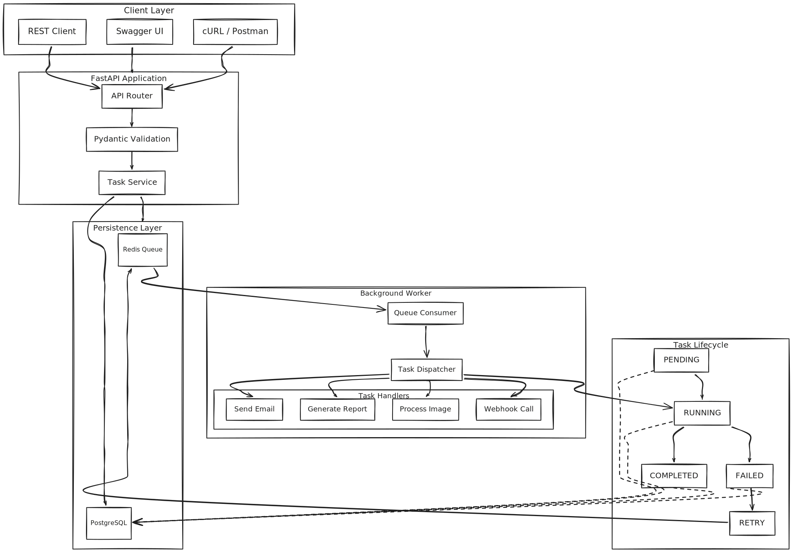
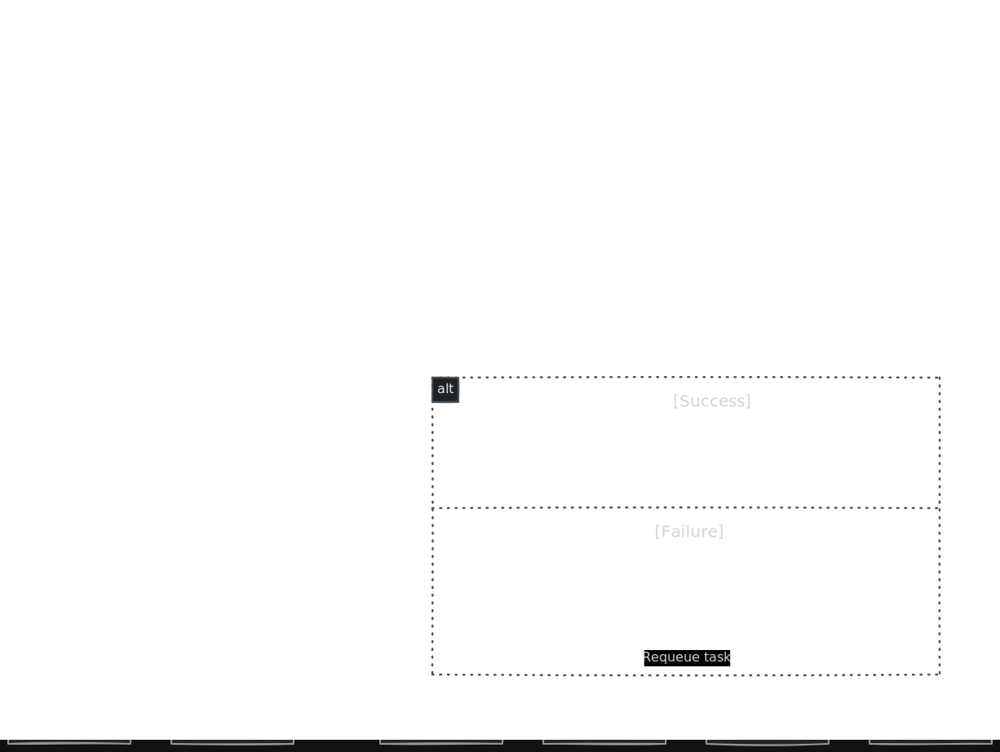

# AsyncForge

AsyncForge is a lightweight asynchronous task processing system built with FastAPI, PostgreSQL, Redis, and Docker. It provides a RESTful API for submitting background jobs, persists task metadata in PostgreSQL, distributes work through a Redis-backed queue, and executes tasks using dedicated worker processes.

The project demonstrates the architecture of a production-style task queue by separating request handling, task persistence, queue management, and background execution into independent components. It includes retry support, automated testing, Docker-based deployment, and performance benchmarking.

---

## Features

- RESTful API for task management
- Asynchronous background task execution
- Redis-backed task queue
- PostgreSQL task persistence
- Configurable retry mechanism
- Multiple task handlers
- Background worker architecture
- Dockerized deployment
- Unit and integration testing
- Performance benchmarking

---

## Architecture

<p align="center">
    
</p>

AsyncForge follows a layered architecture that separates client interaction, API processing, persistence, and background execution.

- Incoming requests are validated by FastAPI and Pydantic.
- Task metadata is stored in PostgreSQL.
- Task identifiers are pushed into a Redis queue.
- Background workers consume queued tasks.
- The dispatcher routes each task to the appropriate handler.
- Task status is updated throughout its lifecycle.

---

## Request Flow

<p align="center">
    
</p>

The request lifecycle consists of two independent stages.

1. The API validates the incoming request, stores the task in PostgreSQL, pushes the task identifier into Redis, and immediately returns a response to the client.
2. The worker continuously listens for queued tasks, executes the appropriate handler, updates the task status, and retries failed tasks when applicable.

---

## Project Structure

```text
AsyncForge/
│
├── app/
│   ├── api/
│   ├── models/
│   ├── queue/
│   ├── schemas/
│   ├── services/
│   ├── tests/
│   │   ├── integration/
│   │   ├── performance/
│   │   └── unit/
│   ├── utils/
│   └── workers/
│
├── benchmarks/
├── Dockerfile
├── docker-compose.yml
├── requirements.txt
└── README.md
```

---

## Technology Stack

| Component        | Technology |
| ---------------- | ---------- |
| Language         | Python     |
| Framework        | FastAPI    |
| Database         | PostgreSQL |
| Queue            | Redis      |
| ORM              | SQLAlchemy |
| Data Validation  | Pydantic   |
| Containerization | Docker     |
| Testing          | Pytest     |

---

## Installation

Clone the repository.

```bash
git clone https://github.com/AskariAbidi18/AsyncForge.git

cd AsyncForge
```

Build and start all services.

```bash
docker compose up --build
```

The application will be available at

```
http://localhost:8000
```

Interactive API documentation can be accessed at

```
http://localhost:8000/docs
```

---

## Configuration

AsyncForge uses environment variables for configuration.

Example:

```env
POSTGRES_USER=postgres
POSTGRES_PASSWORD=password
POSTGRES_DB=asyncforge

POSTGRES_HOST=postgres
POSTGRES_PORT=5432

REDIS_HOST=redis
REDIS_PORT=6379
```

---

## Running Without Docker

Install dependencies.

```bash
pip install -r requirements.txt
```

Start PostgreSQL and Redis.

Run the API server.

```bash
uvicorn app.main:app --reload
```

Start the worker in another terminal.

```bash
python worker.py
```

---

## API Endpoints

| Method | Endpoint                 | Description           |
| ------ | ------------------------ | --------------------- |
| POST   | `/tasks`                 | Create a new task     |
| GET    | `/tasks`                 | Retrieve all tasks    |
| GET    | `/tasks/{task_id}`       | Retrieve a task by ID |
| PATCH  | `/tasks/{task_id}/retry` | Retry a failed task   |
| DELETE | `/tasks/{task_id}`       | Delete a task         |

---

## Testing

Run the complete test suite.

```bash
pytest
```

Generate coverage.

```bash
pytest --cov=app
```

Run the performance benchmark.

```bash
python -m app.benchmarks.load_test
```

---

## Benchmark Results

Performance measurements were obtained on a local Docker deployment using PostgreSQL and Redis.

| Metric              |              Value |
| ------------------- | -----------------: |
| Requests            |                200 |
| Concurrent Workers  |                 20 |
| Successful Requests |                200 |
| Failed Requests     |                  0 |
| Average Latency     |          321.67 ms |
| Median Latency      |          309.26 ms |
| Maximum Latency     |          562.05 ms |
| Throughput          | 59.65 requests/sec |

---

## Future Enhancements

The following improvements are planned for future releases.

- Task prioritization
- Scheduled task execution
- Delayed retries with exponential backoff
- Multiple worker processes
- Worker health monitoring
- Metrics endpoint
- Authentication and authorization
- Rate limiting
- Queue statistics dashboard

---

## License

This project is licensed under the MIT License.
